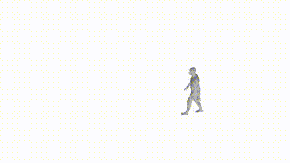

# FS_Video_IMU_Fusion
This is the PyTorch implementation of 3-D human motion tracking from videos and/or IMUs.
<br><br><br>

| Sample result |
| ------------- |
|  |
<br><br>

## 1. Installation
```bash
conda create -n vifusion python=3.9
conda activate vifusion
# Please install PyTorch according to your CUDA version.
pip install torch==1.10.0+cu111 torchvision==0.11.0+cu111 torchaudio==0.10.0 -f https://download.pytorch.org/whl/torch_stable.html
pip install -r requirements.txt
```

<br><br>

## Dataset
We used [AMASS](https://amass.is.tue.mpg.de/) dataset for training the networks and [TotalCapture](https://cvssp.org/data/totalcapture/) dataset for the evaluation. To reproduce our networks, please do the following steps.

```bash
mkdir dataset
```
1. Download AMASS motion file from [AMASS official website](https://amass.is.tue.mpg.de/). You can skip for TotalCapture dataset as we use it for the validation. Then unzip all sub-datasets under the folder of `dataset/AMASS`.
2. Download Total Capture dataset from [Total Capture official website](https://cvssp.org/data/totalcapture/). You need to download videos (for 2D keypoints detection) and IMU data.
3. Run off-the-shelf 2D keypoints detection models (e.g., [ViTPose](https://github.com/ViTAE-Transformer/ViTPose), [CPN](https://github.com/GengDavid/pytorch-cpn)]) and store detection under the Total Capture dataset folder.
4. Download SMPL body models. You can find those from [SMPLify official website](https://smplify.is.tue.mpg.de/download.php).

After following above steps, your folder structure should look like: <br>
```
$(REPO ROOT)/
|-- dataset
|   |-- AMASS/
|       |-- CMU/
|       |-- ...
|
|   |-- TotalCapture/
|       |-- calibration.cal
|       |-- S1
|            |-- acting1_Xsens_AuxFileds.sensors
|            |-- s1_acting1_calib_imu_ref.txt
|            |-- TC_S1_acting1_cam1.mp4
|            |-- ...
|       |-- S2
|       |-- S3
|       |-- S4
|       |-- S5
|       |-- detection
|            |-- S1_acting1_cam1.npy
|            |-- S1_acting1_cam2.npy
|            |-- ...
|
|   |-- body_models/
|       |-- smpl/
|           |-- SMPL_FEMALE.pkl
|           |-- ...
```

5. Process data:
```bash
python -m lib.data.gendb_amass          # Process AMASS dataset
python -m lib.data.gendb_totalcapture   # Process Total Capture dataset
```

<br><br>

## Train the model
To train our model from the scratch:

1. IMUNet: `python -m lib.core.train -c configs/imunet.yaml`
2. VideoNet: `python -m lib.core.train -c configs/videonet.yaml`
3. FusionNet: `python -m lib.core.train -c configs/fusionnet.yaml`

<br><br>

## Work in progress
We Plan to update this repository with following functions:

- [ ] Upload pretrained model checkpoints
- [ ] Write demo code with demo video & IMU data
- [ ] Update citation